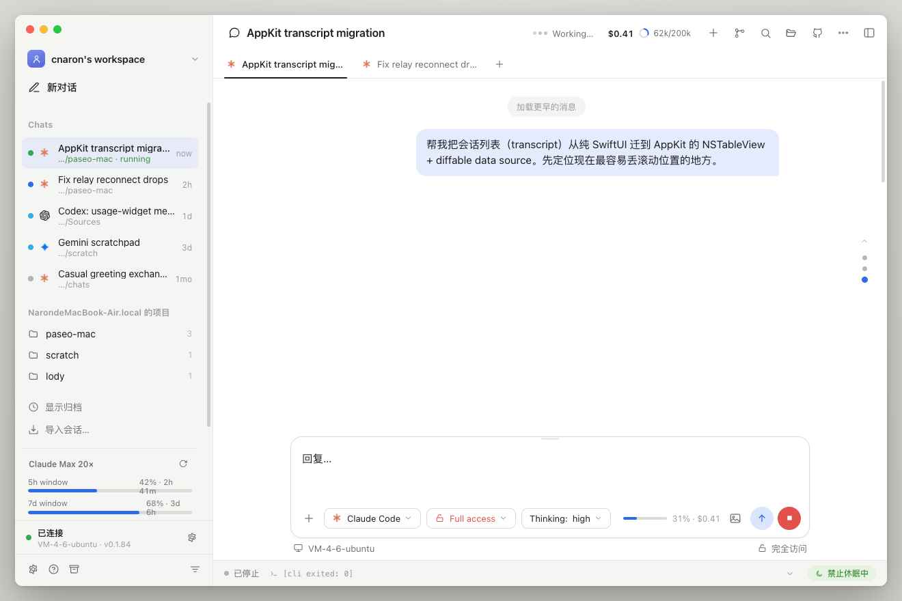
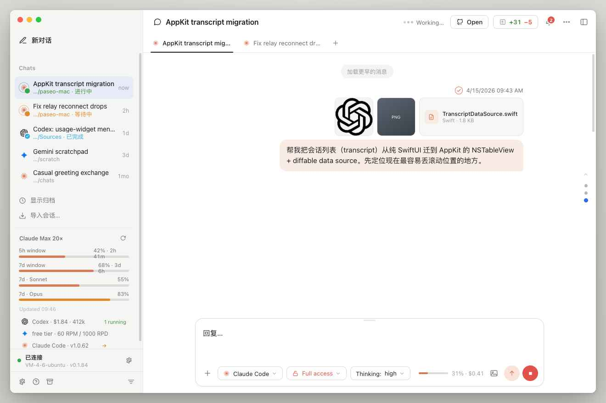
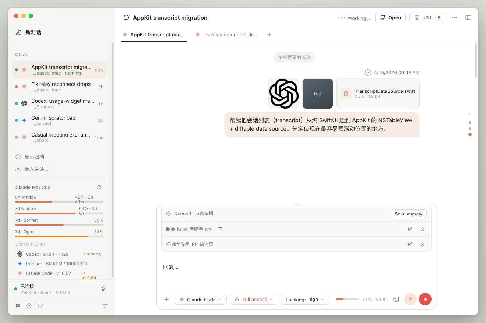

# paseo-mac

[中文](README.zh.md)

Native macOS client for interacting with [Claude Code](https://claude.ai/code) agents running remotely on a server or VPS.

## Screenshots



| Sidebar — live agent states | Attachments, queued messages & usage panel |
|---|---|
|  |  |

## Why this exists

[Paseo](https://github.com/getpaseo) has an official Mac app. It works, but it's Electron-based and carries a heavy memory footprint — noticeable if you keep it open alongside other tools all day.

This is a lightweight SwiftUI replacement. It speaks the same relay protocol as the official app, so it connects to the same daemon and sees the same agents. The difference is purely in the client: native rendering, minimal memory use, no bundled Chromium.

## What it does

- **Sidebar** — agents grouped by workspace, four live states (running / waiting / done / idle) with animated status rings; docked usage panel pinned at the bottom
- **Tabs** — multiple open conversations in the same workspace, switch without losing scroll position
- **Conversations** — markdown, code highlighting, tool-use clusters, inline images; lazy-rendered (last 30 turns, "show earlier" pages back) to keep memory low
- **Per-turn info** — model name and elapsed time below each assistant reply
- **File preview** — click a file path or the changes/files panel to open it as a full page over the conversation, ✕ to close
- **Composer** — send messages, queue follow-ups while the agent works, attach images and text/code files; per-agent model / permission-mode / thinking pickers
- **Search** — filter messages in any conversation
- **Quota panel** — Claude.ai subscription usage (5h / 7d windows), plus a one-click **Claude Code update** when a newer CLI version is available
- **Adjustable** — body font size and line spacing in Settings; multiple provider support (Claude / Codex / Gemini)

## Compared to the official Paseo Mac app

**Read this before using.**

- **Not feature-complete.** The official app has capabilities this one doesn't — settings panels, onboarding flows, and other UI that wasn't replicated here. If something is missing, use the official app for that task.
- **Protocol fragility.** This app speaks the `@getpaseo/server` WebSocket protocol based on observation, not documentation. Any protocol update can silently break it.
- **Not official.** No affiliation with Anthropic or the Paseo team. No support, no guarantees.
- **No Apple notarization.** The binary is unsigned. macOS will warn you on first launch — right-click → Open to proceed.
- **Quota panel needs extra setup.** The sidebar usage bars require a self-hosted VPS endpoint (see below). The official app handles this differently.
- **macOS 14+ only.** Uses SwiftUI Observation (`@Observable`), which requires Sonoma or later.

## Memory & size

Measured on Apple Silicon (M-series Mac):

| | PaseoMac | Official Paseo |
|---|---|---|
| App bundle | ~4 MB | ~350 MB (includes Chromium) |
| Memory in use | ~150–250 MB | ~450 MB+ typical (3 processes) |
| Runtime | SwiftUI native | Electron |

Memory figures are approximate. PaseoMac runs as a single process; it was measured on Air with an active connection and a conversation loaded. Official Paseo spreads its footprint across a main process plus GPU/renderer helpers, so its true total is the sum of those — your mileage may vary. (Earlier minimal builds of PaseoMac idled around ~80 MB; the current richer redesign trades some of that for the tabbed UI and syntax highlighting — trimming this back is on the roadmap.)

## Install

Download **PaseoMac.zip** from [Releases](https://github.com/cnaron/paseo-mac/releases), unzip, drag to Applications.

First launch: right-click the app → **Open** (Gatekeeper blocks unsigned apps on double-click).

## Connect

You need a Paseo daemon running somewhere. Install it with:

```bash
npm i -g @getpaseo/cli
paseo onboard
```

Then from the daemon machine, copy the pairing offer. In PaseoMac: click the gear icon → paste the offer → **Connect**.

## Quota panel (optional)

The app cannot reach the Anthropic usage API directly — the Mac may not have outbound internet. The VPS fetches it and serves it locally.

**VPS side** — create `~/usage-api/fetch.sh`:

```bash
#!/bin/bash
set -euo pipefail
CREDS="$HOME/.claude/.credentials.json"
ACCESS_TOKEN=$(python3 -c "import json; print(json.load(open('$CREDS'))['claudeAiOauth']['accessToken'])")
SUB_TYPE=$(python3 -c "import json; print(json.load(open('$CREDS')).get('claudeAiOauth',{}).get('subscriptionType',''))" 2>/dev/null || echo "")
RESP=$(curl -sf -H "Authorization: Bearer $ACCESS_TOKEN" -H "anthropic-beta: oauth-2025-04-20" -H "User-Agent: claude-code/2.1" --max-time 15 "https://api.anthropic.com/api/oauth/usage")
python3 -c "
import json,sys,time
d=json.loads(sys.argv[1]); d['subscription_type']=sys.argv[2]; d['fetched_at']=int(time.time())
print(json.dumps(d))
" "$RESP" "$SUB_TYPE" > ~/usage-api/cache.json
```

```bash
chmod +x ~/usage-api/fetch.sh && ~/usage-api/fetch.sh
# Refresh every 5 minutes:
(crontab -l 2>/dev/null; echo "*/5 * * * * $HOME/usage-api/fetch.sh") | crontab -
```

**nginx** — add a token-protected location:

```nginx
location = /api/claude-usage {
    if ($http_x_usage_token != "YOUR_SECRET_TOKEN") { return 401; }
    alias /home/youruser/usage-api/cache.json;
    default_type application/json;
}
```

**App** — open **Preferences (⌘,) → Integration**, enter the endpoint URL and token.

## Credits

This project was built entirely with [Claude Code](https://claude.ai/code) (Anthropic). All source code was generated by Claude Sonnet and Opus.

## License

MIT
